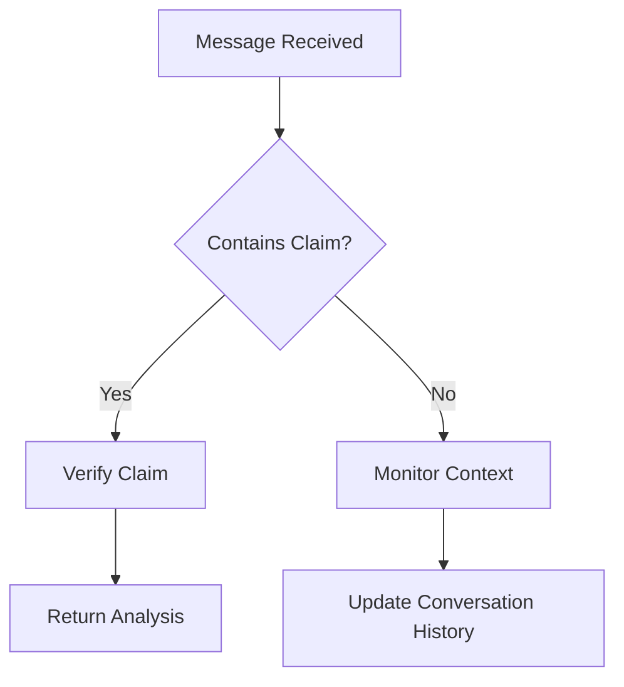

# Arbiter - Advanced Discord Misinformation Detection Bot

Arbiter is a sophisticated Discord bot designed to combat misinformation through intelligent fact-checking and contradiction detection. The bot monitors Discord channels for potentially false claims, verifies them against authoritative sources, and provides educational responses to users.

## 🚀 Key Features

### Zero False Positives Architecture
- **High Confidence Threshold**: Only flags content when confidence exceeds 80%
- **Multi-Step Verification**: Comprehensive fact-checking pipeline with multiple validation layers
- **Conservative Approach**: Errs on the side of caution to maintain user trust

### Advanced AI-Powered Analysis
- **Claim Extraction**: Identifies verifiable factual statements while filtering out opinions and sarcasm
- **Plausibility Check**: Initial assessment to catch obviously true/false claims
- **Source Verification**: Google Search integration to find authoritative sources
- **Cross-Reference Analysis**: Compares claims against multiple credible sources
- **Contradiction Detection**: Analyzes user's message history for inconsistencies
- **Confidence Scoring**: Final assessment with rigorous threshold requirements

### Educational Approach
- **Non-Confrontational Responses**: Focuses on media literacy rather than direct contradiction
- **Source Transparency**: Provides links to reliable sources for verification
- **User-Friendly Messaging**: Simple, helpful explanations without technical jargon

## 🔧 How It Works

### 1. Message Monitoring
The bot continuously monitors Discord channels for messages containing factual claims.

### 2. Claim Analysis Pipeline
When a message is detected, Arbiter runs through this process:

```
Message Input
    ↓
Claim Extraction (filters opinions/sarcasm)
    ↓
Plausibility Check (catches obvious cases)
    ↓
Google Search (finds authoritative sources)
    ↓
Source Analysis (evaluates credibility & consensus)
    ↓
Contradiction Detection (checks user history)
    ↓
Confidence Scoring (>80% threshold required)
    ↓
Educational Response (if flagged)
```

### 3. Response Generation
Only when high confidence is achieved:
- Provides educational information
- Links to authoritative sources
- Suggests further reading
- Maintains respectful tone

## 🛠️ Technical Architecture

### Core Components
- **Discord.js v14**: Real-time message monitoring
- **OpenAI GPT-4o**: Natural language processing and analysis
- **Google Custom Search API**: Authoritative source discovery
- **MongoDB**: Persistent memory and fact-check history
- **Express.js**: Web server for hosting platforms

### Safety Features
- **Conservative Thresholds**: Multiple confidence checks
- **Source Quality Assessment**: Prioritizes .edu, .gov, and reputable news sources
- **Comprehensive Logging**: Detailed fact-checking audit trail
- **Error Handling**: Graceful degradation when services are unavailable

## 🎯 Usage

### Bot Activation
- **Direct Mentions**: `@Arbiter question here`
- **Reply to Bot**: Reply to any bot message
- **Automatic Monitoring**: Analyzes all messages for misinformation (responds only when high confidence)

### Commands
The bot primarily works automatically but responds to:
- Direct questions about facts
- Requests for source verification
- General conversation when mentioned

## 🔐 Environment Setup

Required environment variables:
- `DISCORD_TOKEN`: Bot token from Discord Developer Portal
- `OPENAI_API_KEY`: OpenAI API key for AI analysis
- `GOOGLE_SEARCH_API_KEY`: Google Custom Search API key
- `MONGODB_URI`: MongoDB connection string

## 🚀 Deployment

The bot is designed to run on platforms like Render, Heroku, or Replit:

1. Set up environment variables
2. Enable Discord bot intents (MESSAGE CONTENT INTENT required)
3. Invite bot to your Discord server with appropriate permissions
4. Bot will start monitoring automatically

## 📊 Database Schema

### User Memory
- Personal context and preferences
- Fact-check history
- Conversation summaries

### Channel Memory
- Recent message history
- Misinformation alerts
- Channel-specific context

### Fact Check Records
- Detailed verification results
- Source analysis
- Confidence scores
- Reasoning trails

## 🔍 Source Quality Standards

Arbiter prioritizes sources in this order:
1. **Government/Educational** (.gov, .edu domains)
2. **Established News Organizations** (Reuters, AP, BBC, NPR)
3. **Scientific/Medical Authorities** (NIH, WHO, Nature, Science)
4. **International Organizations** (UN, World Bank)
5. **Reputable Reference Sources** (Britannica)

## 🛡️ Anti-False Positive Measures

- **Multiple Verification Steps**: Each claim undergoes 4-5 analysis stages
- **Source Consensus Required**: Multiple sources must agree before flagging
- **Context Awareness**: Considers sarcasm, hypotheticals, and opinions
- **Human-Like Reasoning**: Uses advanced AI to understand nuance
- **Confidence Calibration**: Only acts on very high confidence assessments

## 📈 Performance Monitoring

The bot logs all fact-checking activities with:
- Claim analysis results
- Source quality assessments
- Confidence calculations
- Response effectiveness
- User interaction patterns

This enables continuous improvement and accuracy validation.

---

*Arbiter helps maintain factual accuracy in Discord debates while respecting users and promoting media literacy.*# 🤖 Arbiter - Advanced Discord Misinformation Detection Bot

 *🛡️ Combating misinformation through AI-powered fact-checking*

## ✨ Key Features

- **Multi-Step Verification Process**  
  4-stage pipeline ensuring reliable fact checks
- **Source Reliability Analysis**  
  Prioritizes .gov/.edu domains and peer-reviewed research
- **Context-Aware Processing**  
  Thread history analysis for better context understanding
- **Educational Responses**  
  Provides sources and explanations for transparency
- **Performance Monitoring**  
  Detailed analytics and error tracking

## 🚀 Getting Started

### Prerequisites
- Node.js 18+
- MongoDB database
- Discord Developer Account
- OpenAI API Key
- Google Search API Key

### Installation
```bash
# Clone repository
git clone https://github.com/yourusername/arbiter.git
cd arbiter

# Install dependencies
npm install

# Set up environment variables (create .env file)
cp .env.example .env
```

### Configuration (.env)
```ini
DISCORD_TOKEN=your_discord_bot_token
OPENAI_API_KEY=your_openai_key
MONGODB_URI=mongodb://localhost:27017/arbiter
EXA_API_KEY=your_exa_search_key
```

## 🤖 Bot Features Deep Dive

### Fact-Checking Process
1. **Claim Extraction** - Identifies verifiable statements
2. **Plausibility Check** - Initial AI assessment
3. **Source Verification** - Aggregates authoritative evidence
4. **Confidence Scoring** - Calculates verification certainty



### Interactive Commands
- `@Arbiter explain` - Detailed confidence breakdown
- `@Arbiter sources` - Show verification sources
- `@Arbiter challenge` - Dispute a fact-check
- `@Arbiter history` - Show user fact-check record

## 🛠️ Technical Architecture

### Core Technologies
- **AI Processing**: GPT-4o
- **Database**: MongoDB with TTL indexes
- **Search**: Exa.ai Web Search API
- **Error Handling**: Circuit breaker pattern
- **Caching**: Tiered content caching system

### Security Features
- High confidence thresholds (>80%)
- Source credibility scoring
- Error fallback systems
- Rate limiting protection
- Audit logging

## 📊 Database Schema

```javascript
{
  users: {
    userId: String,
    factChecks: [{
      claim: String,
      status: String,
      confidence: Number,
      sources: Array
    }]
  },
  channels: {
    messageHistory: Array,
    factCheckAlerts: Array
  }
}
```

## 📜 License
MIT License - See [LICENSE](LICENSE) for details

> **Note:** This project follows strict ethical AI guidelines and prioritizes transparency in its operations. Human verification is always recommended for critical decisions.
